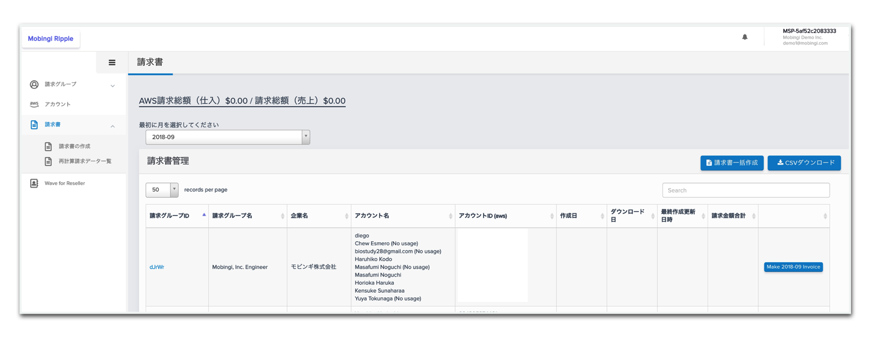
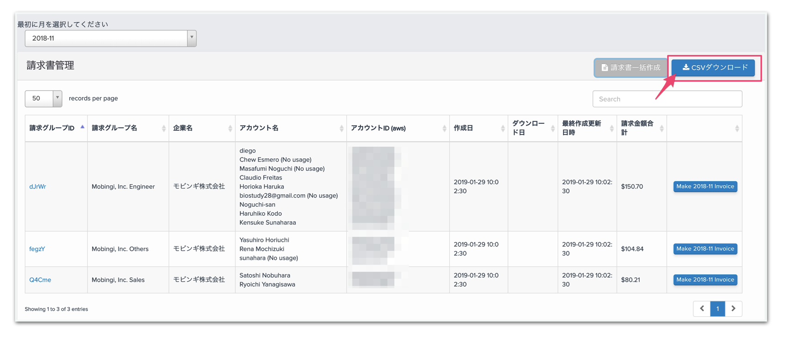

# 請求書を発行する

[※ 請求書発行する前に、請求データ確定のご連絡と集計作業が必要です。](https://docs.mobingi.com/v/ripple/mobingi-ripple/about)

## 1. 為替レートを登録する  

まずは今月分の為替レートを設定しましょう。

1. 画面右上のドロップダウンメニューより`設定`を選択。
2. 左メニューの`換算レート設定`を選択し今月分のレートを設定。

レートを再設定すると当月分のレートが上書きされます。過去のデータを変更することはできません。

メニューの`ユーザー設定`より下記の請求書設定ができます。

* 端数丸め処理：切り捨て、切り上げ、四捨五入 日本円に変換するタイミングでの小数点以下の扱いを設定できます。 
* 消費税集約レベル：サービス単位、アカウント単位、請求グループ単位 CSVをダウンロードする際の消費税の計算レベルの設定です。 

## 2. Rippleで請求書を発行する  

1. 請求対象の利用月を選択する。 
2. `請求書一括作成`をクリック。 ※ この操作により、「請求グループ毎の請求書（PDF）」と「すべての請求グループの請求データを網羅したCSVファイル」が作成され、`作成日`もしくは`最終作成更新日時`の欄が更新されます。 
3. 請求グループIDをクリックすることで、作成された請求書（HTML）を確認できます。
   * このページを印刷することで請求書としてご利用いただくことが可能です。
   * 一度作成した請求書はRipple内で保存されます。
     * 請求グループIDをクリックすると閲覧できます。
   * 請求書を再作成した場合は上書きされます。

1. `CSVダウンロード`をクリックすると請求データのダウンロードが可能です。

## 3. CSVデータをエクスポートする  

「請求書一括作成」ボタンを押下した後、右隣の`CSVダウンロード`ボタンを押下。この操作を行うと`ダウンロード日`が更新されます。

### CSVデータのフォーマット：アカウント/サービス単位

CSVはこのようなフォーマットで出力されます。オレンジで囲っている単位が各請求書の単位です。

## 4. 請求書を個別に作成する  

1. 請求グループごとに`Make Invoice`をクリック。

これらの値は請求グループに事前に設定することができます。 事前設定内容を、請求書発行時に都度上書きすることが可能です。

* 支払タイプ
* 値引率
* 消費税率
* AWSサポート請求方法
  * パーセント
  * 開発者サポート（AWS）
  * ビジネスサポート（AWS）
  * エンタープライズサポート（AWS）
* 代行手数料
  * パーセント
  * 固定費（ドル）
* 為替レート
* `作成`ボタンを押下するとその請求グループのみ、設定した内容で請求書が作成されます。 請求グループIDをクリックすると更新された請求書（HTML）が確認できます。


個別での作成はダウンロードCSVには反映されません。


