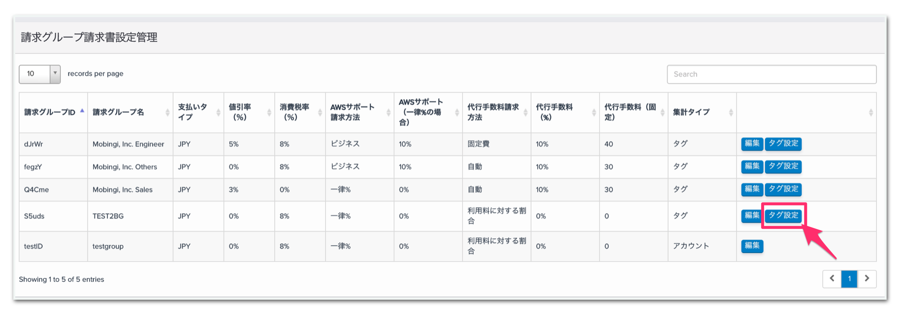

# タグでの請求データ作成

## まずはじめに

タグを使用した請求データの作成機能は現在一部のお客様にのみ追加機能としてご提供しています。ご希望のお客様は ripple\_cs@mobingi.com までご連絡ください。

## Step1. タグの有効化

まずRippleの請求で使用したいタグをAWSの画面から有効化する必要があります。  
（既に有効化している場合はStep2へ移動してください）

## Step2. 請求グループの作成

アカウントで[請求グループを作成する手順](https://docs.mobingi.com/v/ripple/mobingi-ripple/new-customer)と同様に請求に含めたいアカウントを選択します。

## Step3. 請求書設定をタグに変更

メニューの「請求グループ」&gt;&gt;「請求書設定」に移動します。  
各請求グループの中でタグの集計に切り替えたい請求グループの右端にある「編集」をクリックします。

集計タイプを「アカウント集計」から「タグ集計」に変更します。

「登録」ボタンを押下すると先ほどクリックした「編集」の右隣に「タグ設定」のボタンが表示されます。また、集計タイプの項目が「タグ」に変化します。

「タグ設定」をクリックします。

集計に含めたい「Tag Name」と「Tag Value」をドロップダウンから選択します。

ドロップダウンではこの請求グループに紐づくアカウントが使用しているタグが表示され、異なる Tag Name に含まれる複数の Tag Value を選択することが可能です。

事前の設定はここまでです。

## Step4. タグのCSVを出力

ダッシュボードから「請求データ確定の連絡」を実行した後、CSVの生成が完了しましたらサポートより連絡させていただきます。

連絡が届きましたら左メニューの「請求書の作成」に移動、右端のCSVダウンロードをクリックし、ダウンロードフォーマットで「タグ単位」を選択の上ダウンロードしてください。

