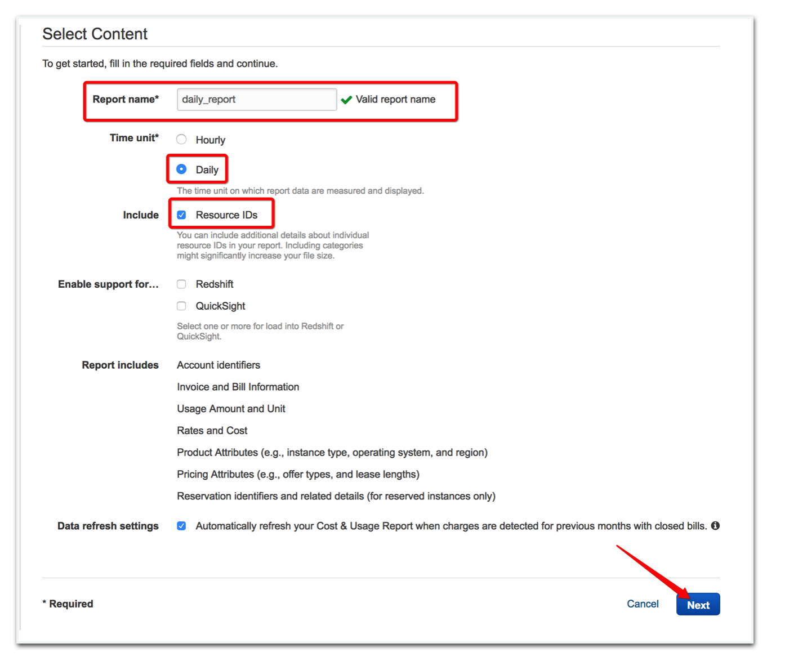
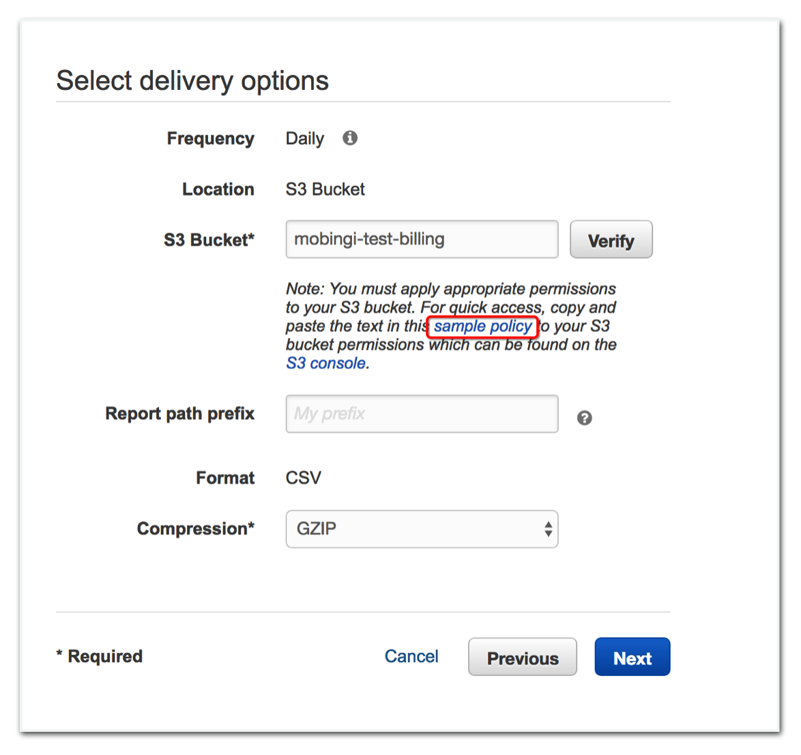
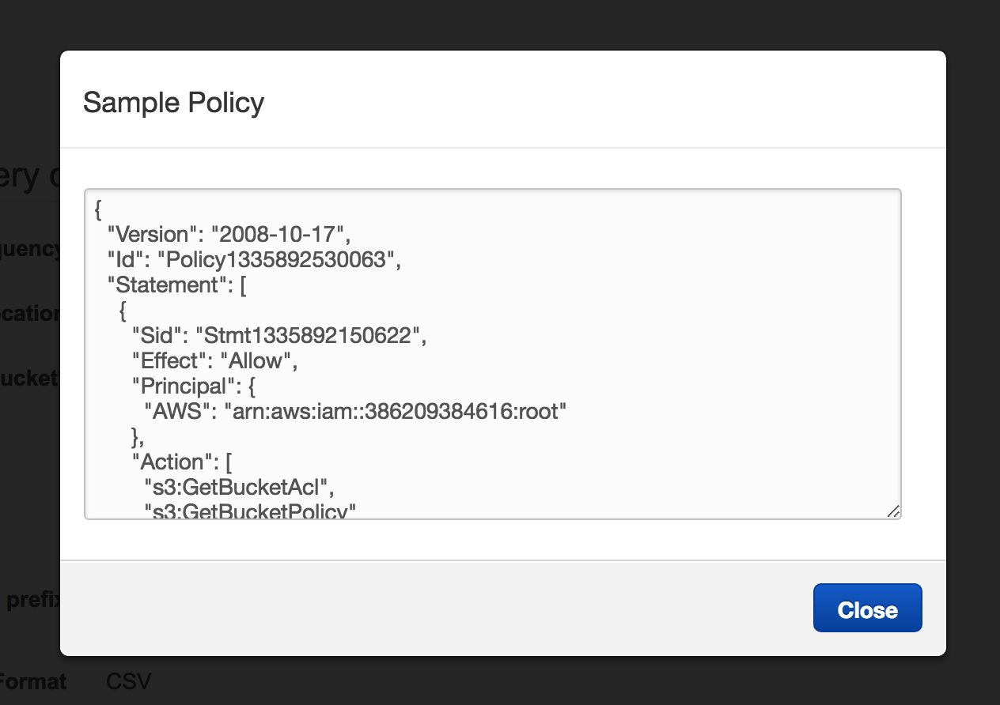
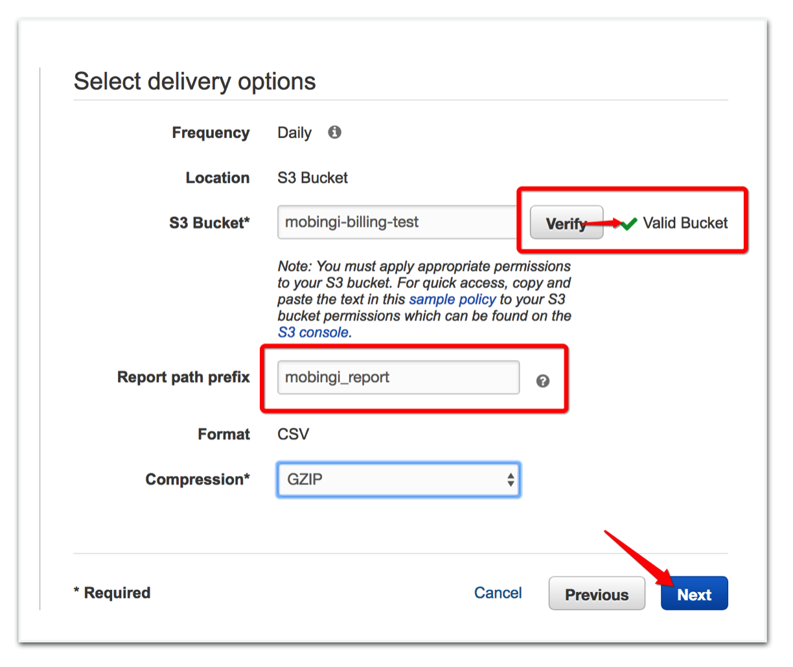
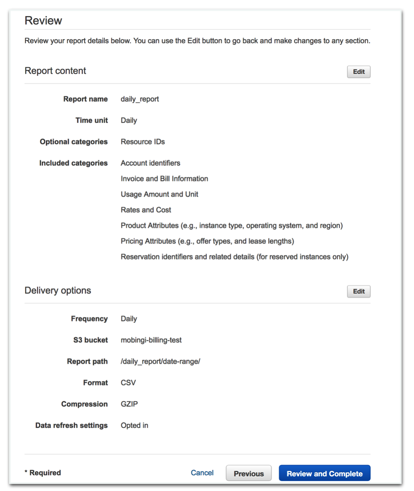
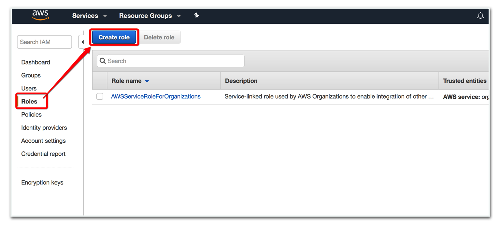
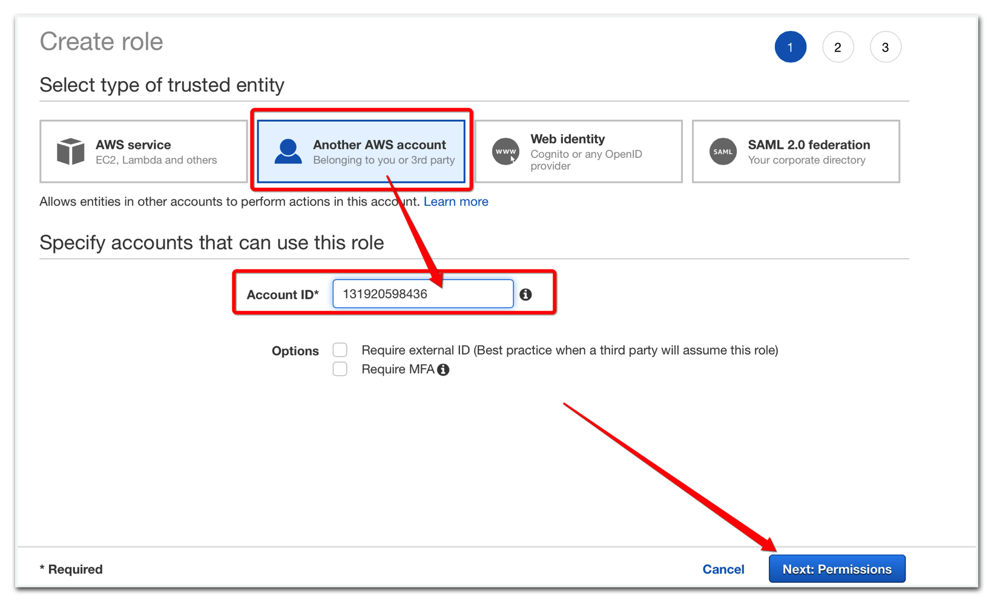
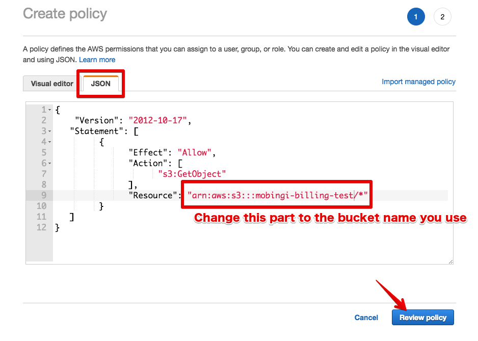
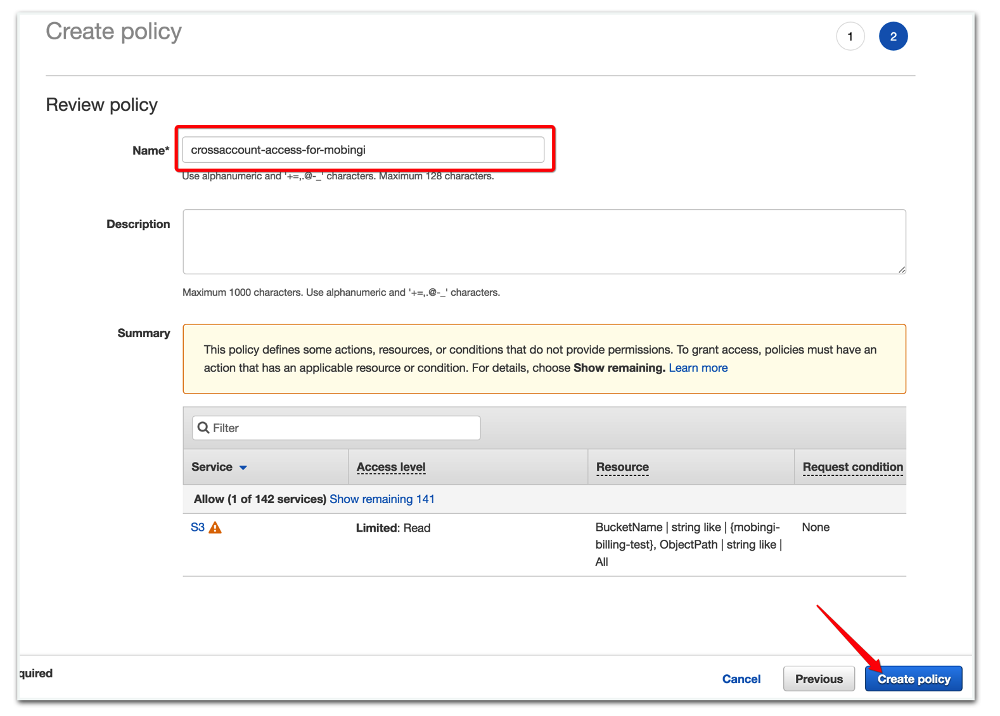
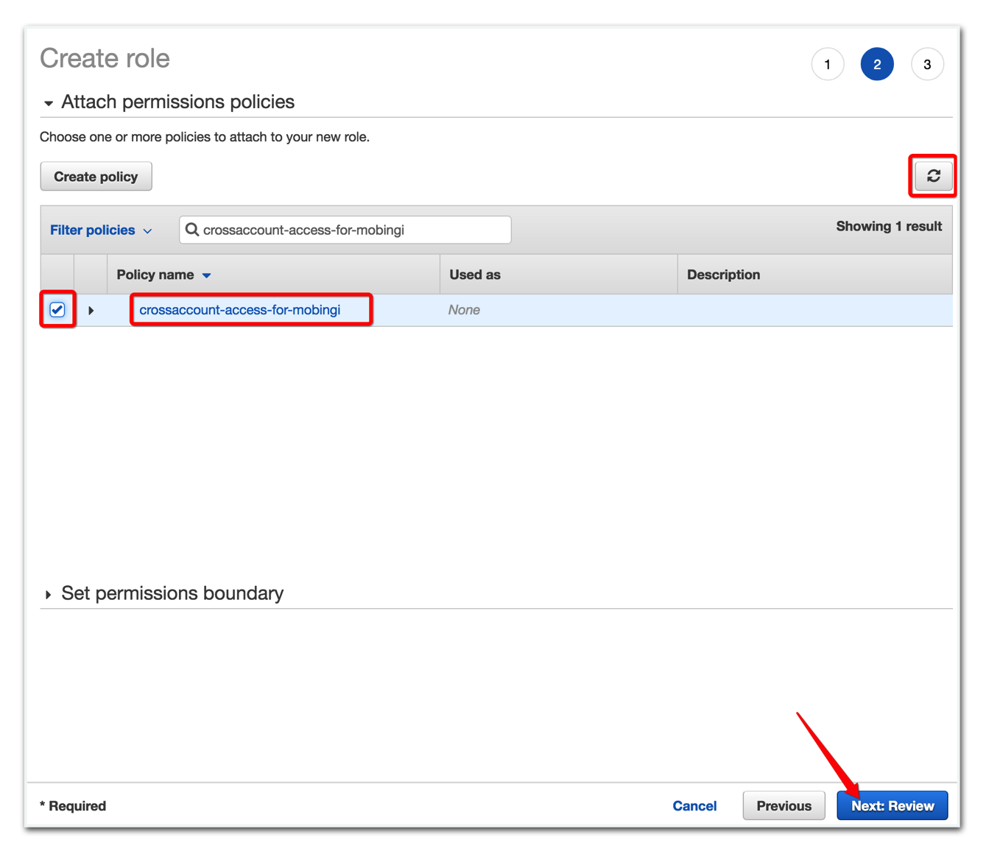

# Preparation

* This page explains things you need to be done on your AWS account for start using Mobingi Wave.
* After finishing preparation, you will need to give Mobingi the below informations. 

```
- AWS account ID (12 digit numbers).

- Information of the report you made.

    - Report name

    - S3 bucket

    - Report path prefix, or Report path

- ARN of IAM Role which allow the specific bucket.(Ex: arn:aws:iam::xxxxxxxxxxxx:role/crossacounnt-access-for-mobingi)
```

## Step 1 : Create S3 bucket and daily report \(option\)  {#step1}

* Create daily repot with the AWS account you want to share the billing information with Wave.
* You can skip if you already have the report definition with below conditions.

  `Time unit:` **`Daily`**

  **`Rsource IDs`**`is included in the report.`

  `There is no object which Mobingi shouldn't see.(Since the access atuhority will be a whole bucket).`

### Step1-1: **Create S3 bucket**

* Create bucket with any name from S3 bucket. Option can leave as default.

  Please keep the bucket name for using it as output destination of report.

### Step1-2: Create daily report

* Choose **Billing** from AWS management console and move to **Reports**.

Click **Create report**.


* Fill out **`Step 1: Select Content`** same as below.
  * Report name: Any
  * Time unit: **Daily**
  * Include: **Resource IDs**
  * Enable support for...: Optional



* **`Step2: Select Delivery Options`** will be the following process.
  * Put S3 bucket name \(you made at Step1-1\)
  * Display and copy **Sample policy** \(\* make sure to click after you entered S3 bucket name\)





* After copy **sample policy,** open the **S3 bucket which you create on step1-1** and open detail \(\* we suggest to open the page with new window or new tab\).
* On S3 page, go to **Permissions** &gt;&gt; **Bucket Policy.**
* Put the policy you copied at before into **Bucket policy editor** and Save.


Go back to **`Step2: Select Delivery Options`** and put below info.

* Report path prefix: Optional  \(\*blank also works\) 
* Compression: Optional

It shows **Valid Bucket** only when the bucket policy is correct.

Check your S3 again.



Check the info again and click **Review and Complete.**



## Step 2 : Create IAM role for Mobingi {#step2}

From AWS management console, select **IAM** service and click **Roles** &gt;&gt; **Create role.**



Choose  **Another AWS Account** at **`Select type of trusted entity`**and put Mobingi account ID.

* Mobingi Account ID: 131920598436



Click **Create policy**.


New tab or window will open. Choose JSON as input format and type the policy same as below. Make sure to change`{replace_to_report_bucket}` at "Resource"  to **the bucket name you use for report.**

```bash
{
    "Version": "2012-10-17",
   "Statement": [
         {
               "Effect": "Allow",
               "Action": [
                     "s3:GetObject",
                     "s3:HeadObject"
               ],
               "Resource": "arn:aws:s3:::{replace_to_report_bucket}/*"
         }
   ]
}
```



After fill the informations below, you can finish to create policy.

* Name: Any \(\*required\)
* Description: Option



Go back to **Create Role** and refresh, the policy suppose to display on the list. Active the policy and move to review page. ****



At **Review**, fill the informations below.

* Role name: Any \(\*required\)
* Role description: Option

After check **Trusted entities** and **Policies** are correctly applied, click **Create role**.


Keep the ARN of the role.


