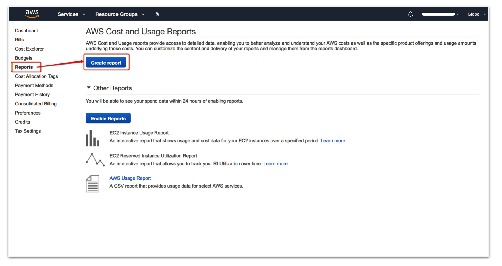
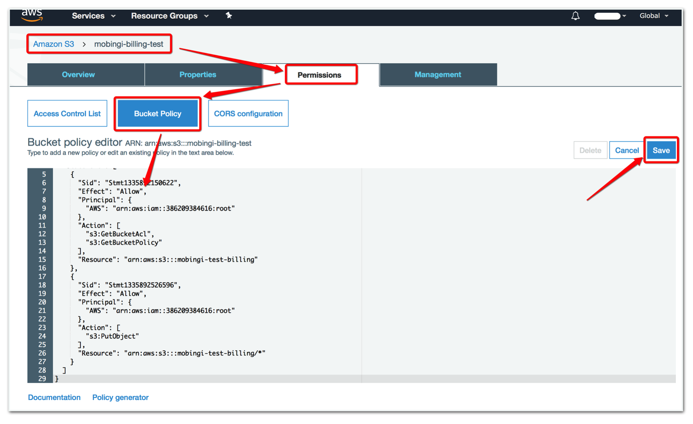
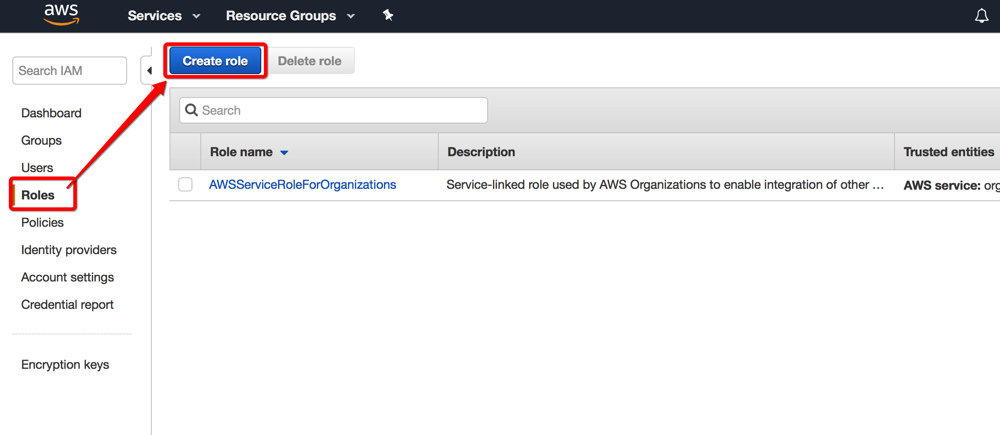

# Preparation

* This page explains thins you need to be done on your AWS account for start using Mobingi Wave.
* After finish preparation, you will need to give Mobingi the below informations. Please keep these info each steps.

```text
- AWS account ID (12 digit numbers).

- Information of the report you made.

    - Report name

    - S3 bucket

    - Report path prefix, or Report path

- ARN of IAM Role which allow the specific bucket.(Ex: arn:aws:iam::xxxxxxxxxxxx:role/crossacounnt-access-for-mobingi)
```

## Step 1 : Create S3 bucket and daily report \(option\) {#step1}

* Create daily repot with the AWS account you want to share the billing information with Wave.
* You can skip if you already have the report definition with below conditions.

  `Time unit:` **`Daily`**

  **`Rsource IDs`**`is included in the report.`

  `There is no object which Mobingi shouldn't see.(Since the access atuhority will be a whole bucket).`

### Step1-1: **Create S3 bucket**

* Create bucket with any name from S3 bucket. Option can leave as default.

  Please keep the bucket name for using it as output destination of report.

### Step1-2: Create daily report

* Choose **Billing** from AWS management console and move to **Reports**.

Click **Create report**.



* Fill out **`Step 1: Select Content`** same as below.
  * Report name: Any
  * Time unit: **Daily**
  * Include: **Resource IDs**
  * Enable support for...: Optional


* **`Step2: Select Delivery Options`** will be the following process.
  * Put S3 bucket name \(you made at Step1-1\)
  * Display and copy **Sample policy** \(\* make sure to click after you entered S3 bucket name\)


* After copy **sample policy,** open the **S3 bucket which you create on step1-1** and open detail \(\* we suggest to open the page with new window or new tab\).
* On S3 page, go to **Permissions** &gt;&gt; **Bucket Policy.**
* Put the policy you copied at before into **Bucket policy editor** and Save.



Go back to **`Step2: Select Delivery Options`** and put below info.

* レポートパスのプレフィックス: 任意 \(※なしでも構いません\)
* 圧縮: 任意

バケットポリシーが正しくない場合、検証で「有効なバケット」となりません。

Check your S3 again.


『ステップ 3: 確認』表示されている内容に間違いがない確認し、完了します。


##  Step 2 :モビンギに読み取り権限を委譲するIAMロールの作成 {#step2}

From AWS management console, select **IAM** service and click **Roles** &gt;&gt; **Create role.**



『信頼されたエンティティの種類を選択』で、「別のAWSアカウントを」選択し、以下のモビンギのアカウントIDを入力します。

* モビンギアカウントID: 131920598436


「アクセス権限ポリシーをアタッチする」メニューで、『ポリシーの作成』を選択します。


別のタブ\(ウィンドウ\)で「ポリシーの作成」メニューが開くので、入力形式にJSONを選択し、以下の内容でポリシーを入力します。 Resourceの`{replace_to_report_bucket}`部分を **レポートに使用するバケット名** に置き換えてください。

```bash
{
    "Version": "2012-10-17",
   "Statement": [
         {
               "Effect": "Allow",
               "Action": [
                     "s3:GetObject",
                     "s3:HeadObject"
               ],
               "Resource": "arn:aws:s3:::{replace_to_report_bucket}/*"
         }
   ]
}
```


「ポリシーの確認」へ進み、以下の項目を入力してポリシーを作成します。

* 名前: 任意\(※必須\)
* 説明: 任意


『ロールの作成』メニューに戻り、リストを更新し、先ほど作成したポリシーを表示します。 チェックを有効にして、確認へ進みます。


「確認」メニューで、以下の項目を入力します。

* ロール名: 任意\(※必須\)
* ロールの説明: 任意

「信頼されたエンティティ」、「ポリシー」が適用されていることを確認し、ロールを作成します。


作成したロールのARNを控えます。


