# 提前准备

* 为了使Mobingi的每日报告分析有效、将讲解需要用在您的AWS帐户的执行任务和需要提交给Mobingi的信息。
* 作业后提交给Mobingi的信息如下。 请您记录每个阶段的作业。 （作业后也可以确认。\)

```text
- AWS帐户ID（12位数）

- 已创建的报告的信息

    - 报告名

    - S3存储桶

    - 报告路径前缀，或报告路径

- 授权指定存储桶用的 IAM角色的ARN (例如: arn:aws:iam::xxxxxxxxxxxx:role/crossacounnt-access-for-mobingi)
```

## 步骤1：创建S3存储桶以及每日报告（任意） {#step1}

* 使用帐单信息共享的AWS帐户创建每日报告。
* 如果您已有以下的报告定义条件，可跳过此操作。

  `时间单位: 每天`

  `报告含有的项目的资源ID将有效`

  `在存储桶中不包含Mobingi不能浏览的对象（为了给整个存储桶阅读访问权）`

### 步骤1-1：创建S3存储桶

* 从S3控制台中用任意的名称创建存储桶。 选项可为默认值。

  因要使用此为报告的输出目标，请记录存储桶名称。

### 步骤1-2：创建每日报告

* 从AWS管理控制台中，打开“帐单信息和成本管理控制面板”，转到报告菜单内。

进行创建报告。

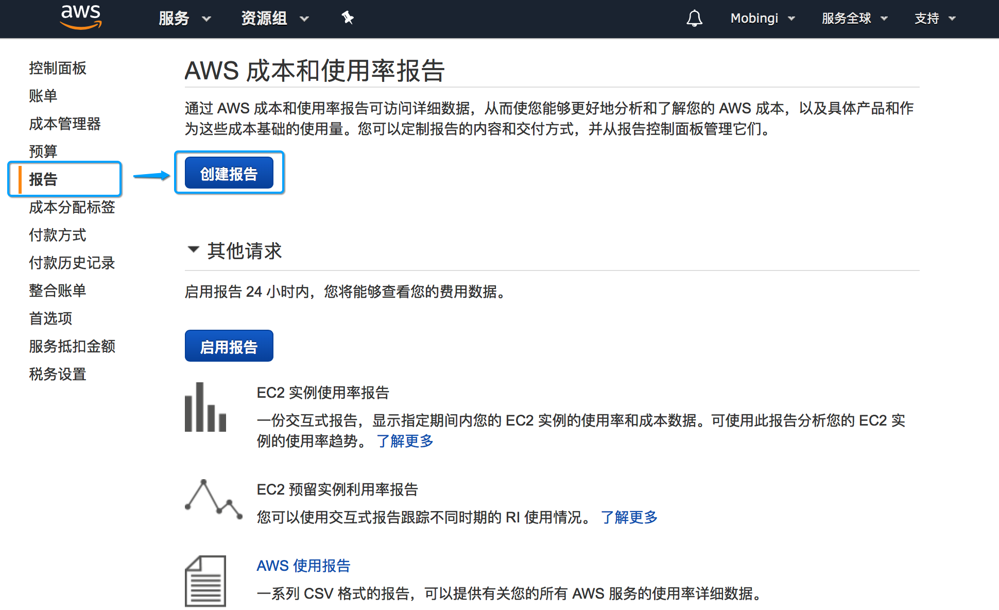

* 在“第1步：选择内容”页面，请填写以下内容进行下一步。
  * 报告名称：任意
  * 时间单位： **每天**
  * 包含: 选择 **资源ID**
  * 对以下内容启用支持: 任意

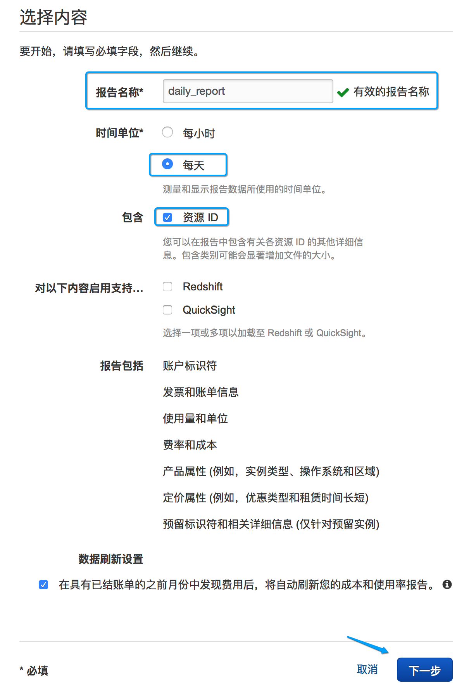

* 在“第2步：选择交付选项”页面，为包括S3存储桶的操作，按以下步骤进行。
  * 输入S3存储桶（之前创建的）名称
  * 示例策略的显示和复制（※请务必在填写S3存储桶名称后在显示）

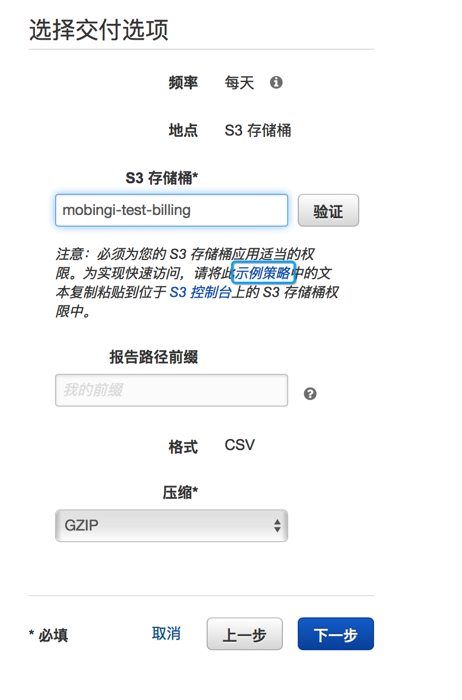

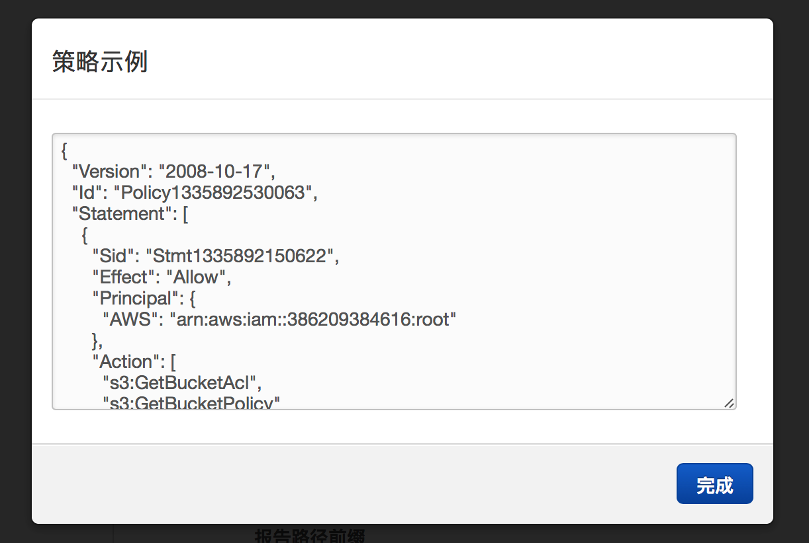

* 复制策略示列后，打开**先前创建的S3存储桶** 的详细信息。（※建议在另一个标签或窗口上操作）
* 在S3中，按“访问权限”&gt;&gt;“存储桶策略”操作菜单。
* 在存储桶策略编辑器中，适用之前的样本策略

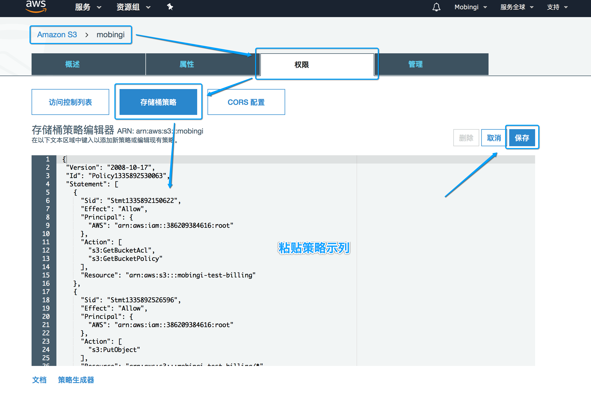

返回到“第2步：选择交付选项”，输入以下项目并进行下一步。

* 报告路径前缀：任意（※也可忽略）
* 圧缩：任意

如果存储桶策略不正确，在验证不会成为“有效桶”。

请再次确认S3菜单。

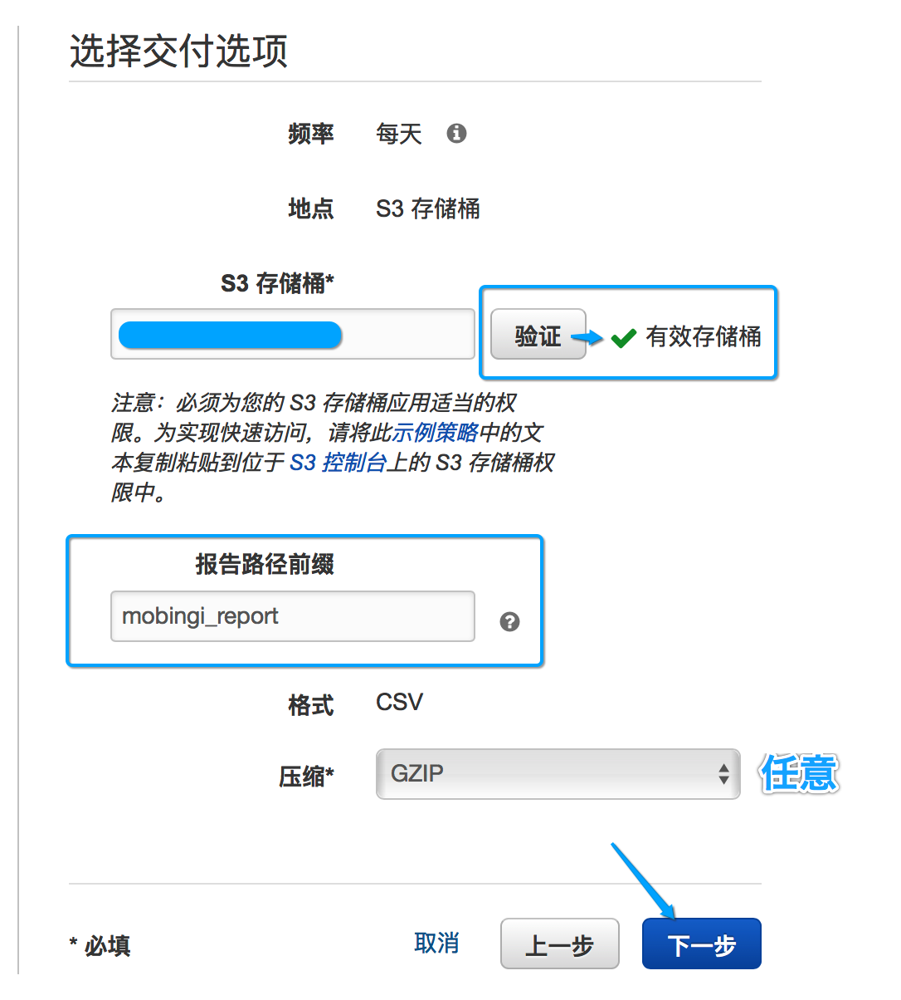

检查“第3步：确认”的显示内容中是否有错误并点击完成。


## 步骤2：创建一个授权Mobingi可以阅读的IAM角色 {#step2}

从AWS管理控制台中，打开IAM服务并转到“角色”&gt;&gt;“创建角色”菜单。

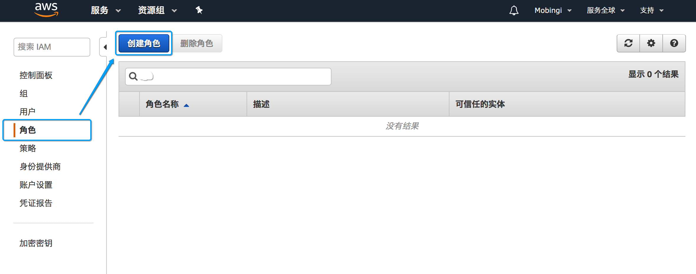

在“选择受信任实体的类型”中选择“其他AWS帐户”，输入下面的Mobingi帐户ID。

* Mobingi帐户ID： 131920598436

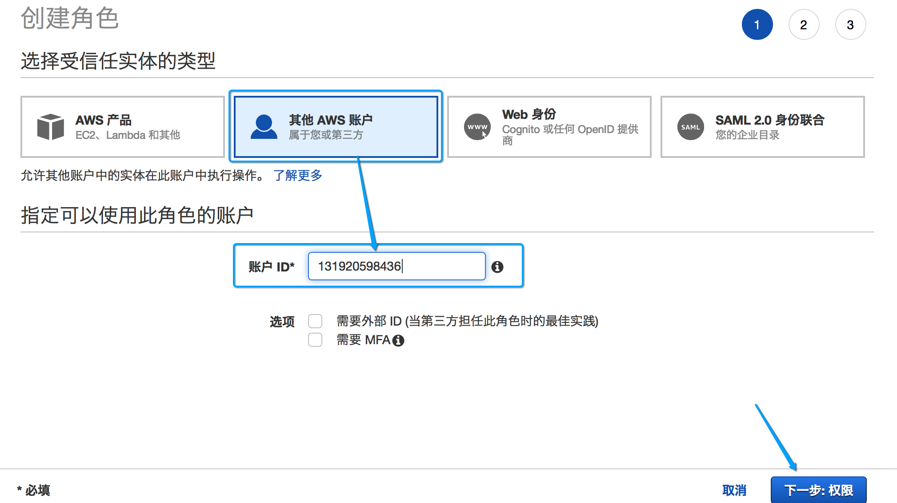

在“Attach permissions policies”菜单中，选择“创建策略”。

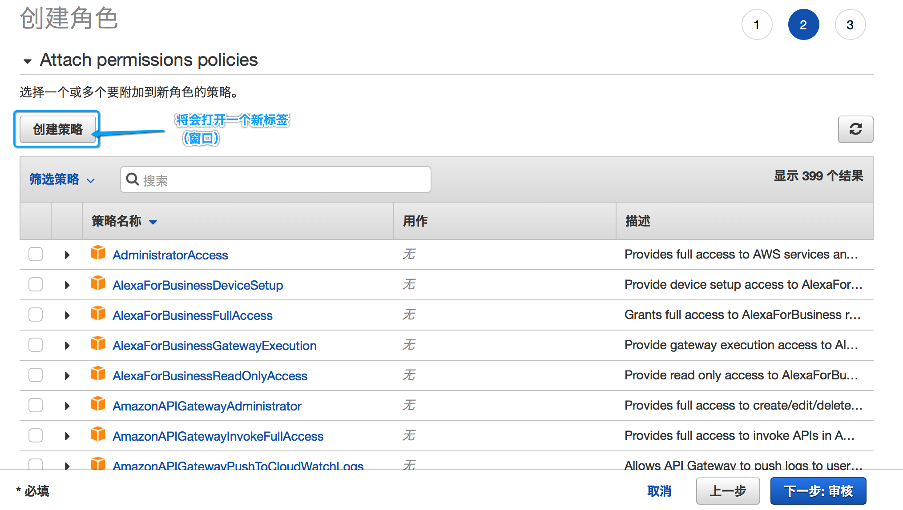

由于在另一个标签（窗口）中打开“创建策略”菜单，选择JSON作为输入格式，以以下的内容输入策略。请将 Resource的`{replace_to_report_bucket}`部分置换为 **要使用的报告的存储桶名称**。

```bash
{
    "Version": "2012-10-17",
   "Statement": [
         {
               "Effect": "Allow",
               "Action": [
                     "s3:GetObject",
                     "s3:HeadObject"
               ],
               "Resource": "arn:aws:s3:::{replace_to_report_bucket}/*"
         }
   ]
}
```


进入“查看策略”，输入以下项目并创建策略。

* 名称： 任意\(※必須\)
* 描述：任意

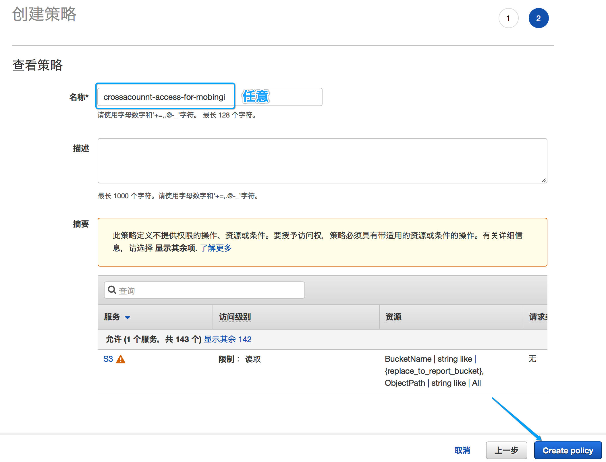

返回“创建角色”菜单并更新列表，显示之前创建的策略。 激活选项，进入下一步确认。

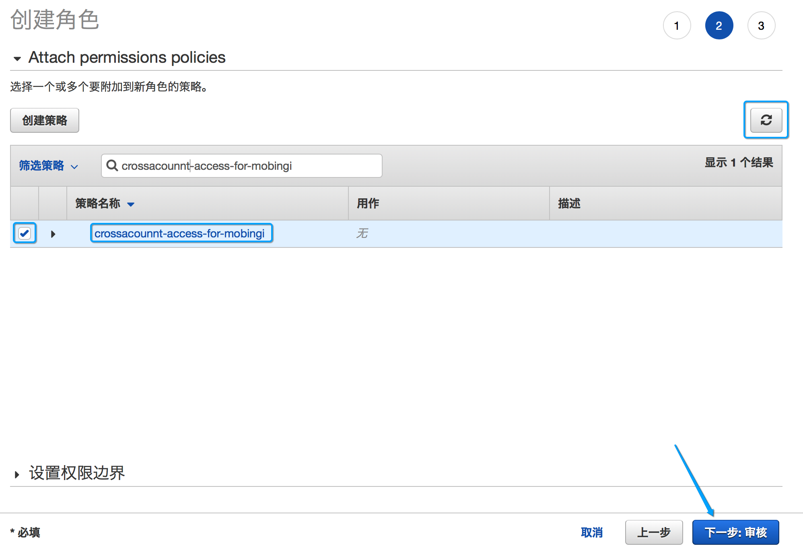

在“确认”菜单中，输入以下项目。

* 角色名称：任意（\*必填）
* 角色描述：可选

确认是否已适用“受信任实体”和“策略”，并创建角色。

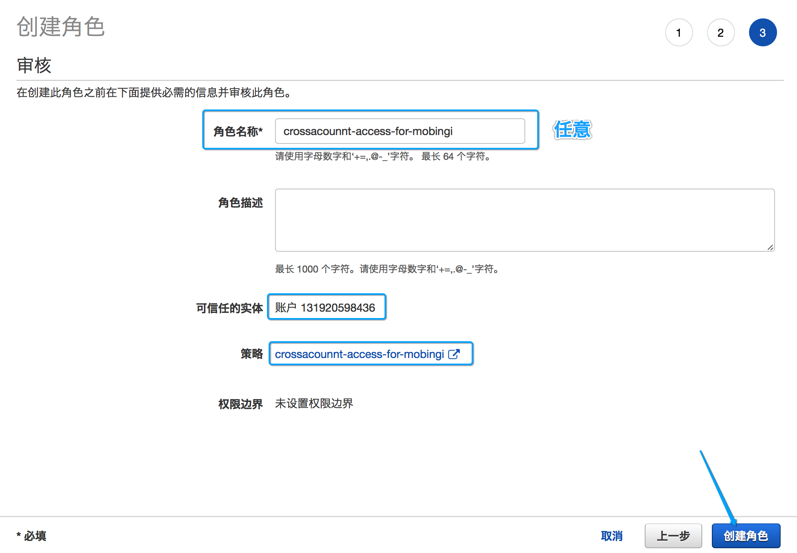

记录已创建的角色的ARN。


